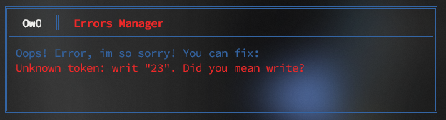

## Welcome to Glint!

Glint is a lightweight interpreted programming language written entirely in Rust. It is designed to be incredibly simple, user-friendly and lightning fast, surpassing languages such as Python in performance by 10 times, and faster than Java by 2 times - in certain benchmarks.

### Features:
- **Interpreted:** Glint is designed to be interpreted, making it easy to run and debug code without compilation steps.
- 
- **Error Handling:** With a beautiful and user-friendly error handler, Glint provides clear feedback when something goes wrong.

  
  
- **Simplicity:** It's simpler than any existing language, with a straightforward syntax and structure that encourages readability and ease of understanding.


- **Performance:** Despite its simplicity, Glint is optimized for speed, making it suitable for performance-critical applications.

  - *Comparison:* Glint is significantly faster than Python and competes closely with other popular languages like JavaScript, Java and Ruby in speed tests.
  
  - **Safety:** Glint has sufficient functionality to ensure sufficient security of your computer resources, due to the grammatical work in Rust.

  - **Dynamic Typing:** Glint embraces dynamic typing, allowing flexibility without the need for explicit type annotations.


### Getting Started
To start using Glint, follow these steps:
1. **Installation:** Clone the repository and compile Glint using Rust's Cargo:
   ```bash
   git clone https://github.com/your_username/glint.git
   cd glint
   cargo build --release
   ```
2. **Run a Glint Program:** Execute a Glint program by passing a `.glt` file as an argument:
   ```bash
   cargo run my_program.glt
   or
   Glint my_program.glt
   ```

### Documentation
Documentation for Glint can be found [here](link_to_your_documentation).

### Examples
Explore examples of Glint code to get a feel for its simplicity and power:
- **Hello World:**
  ```Glint
  write "Hello, World!"
  ```

- **Simple Arithmetic:**
  ```rust
  a is 10
  b is 20
  sum is a + b
  write "Sum:", sum
  ```

### Contributing
Contributions to Glint are welcome! Feel free to fork the repository and submit pull requests.

### License
Glint is licensed under the MIT License. See [LICENSE](./LICENSE) for more details.

---

Join us in making programming simpler and faster with Glint! 🚀
